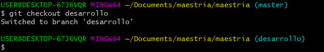
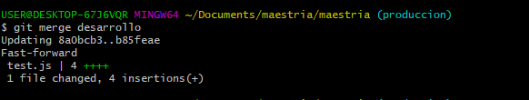

# Controlador Versiones
## Tarea maestria

Git es un sistema de control de versiones que nos permite mantener ordenado las diferentes versiones que hagamos en nuestro proyecto, ademas de poder acceder a nuestro codigo fuente desde cualquier parte del mundo con acceso a internet, trabajar con varios colaboradores, asi como tambien poder volver a un cambio anterior en caso de que la situacion lo amerite.

A continuacion detallamos alguno de los comandos.

### git config --global 
Como primer punto debemos realizar la configuracion del git en la maquina en la cual estamos trabajando para ello debemos asociar la cuenta git a una cuenta de usuario y email.

### git config --global user.name "..."
Este comando permitira asociar a git a la cuenta RolandoCN dentro de la PC.

### git config --global user.email "..."
Este comando permitira asociar a git a la cuenta email juan.roland@outlook.es, dentro de la PC.

### git config --list
Mediante este comando podemos visualizar la informacion de la configuracion de git en la pc que estamos trabajando, como por ejemplo ver a que correo y cuenta de usuario de git esta asociada

### git init
El comado git init permite inicializar o agregar git a un proyecto en desarrollo, es decir que si tenemos un proyecto y deseamos agregarlo a un repositorio de git, debemos primeramente instalar y configurar git, y posteriormente dirigirnos a la carpeta del proyecto abrir la consola y escribir el comando git init.

### git add 
Una vez inicializado git dentro de proyecto si deseamos agregar ya sean carpetas, archivos o cambios al repositorio debemos escribir el comando git add, el cual nos permite dos opciones que se detallan a continuacion.

- git add .  
Permite agregar todos los nuevos cambios del proyecto.

   

- git add test.js
Permite agregar el cambio del archivo escrito, en este ejemplo solo estamos agregando el cambio del archivo, test.js.

   

### git status
Nos permite ver los nuevos cambios realizados dentro del proyecto.

### git commit
Permite asignar de manera descriptiva mediante un nombre o mensaje al cambio realizado y guardarlo en el repositorio de manera local.

### git log
Con este comando podemos visualizar cada uno de los commit relizados dentro de la rama que nos encontremos trabajando.

### git diff
Permite comparar las diferencia entre los cambios realizados ya sea entre ramas o commit, a continuacion el siguiente ejemplo muestro la difrencia de dos commit.

### git branch
Permite trabajar con ramas dentro de git, por defecto git nos provee la rama main o master pero podemos agregar mas ramas, asi como tambien eliminar dichas ramas

### git branch desarrollo
Si deseamos crear una rama debemos escribir git branch mas el nombre de la rama que deseamos crear, para este ejemplo he creado la rama desarrollo con el siguiente comando.

### git checkout desarrollo
Si deseamos movernos a la rama que acabamos de crear debemos escribir el comando git checkout mas el nombre de  la rama en este caso quedaria asi.

Si deseamos movernos a otra rama debemos escribir el comando git checkout mas el nombre la rama que desamos movernos, en este caso voy a volver a la rama master, con el siguiente comando.

### git branch -b produccion
Si deseamos crear una rama y movernos a ella directamente, debemos usar el comando git branch -b mas el nombre la rama, en este ejemplo creare una rama produccion y me movere a ella directamente.

### git merge
Permite fusionar o unir los cambios de dos ramas en una sola es decir, que si deseo obtener los cambios de la rama desarrollo a la de produccion debeo hacer un merge entre ambas, a continuacion se muestra el codigo.

### git show
Permite visualizar de manera detalla y descriptiva cada una de los cambios realizados del proyecto con git ya sea las ramas creadas, los commit generados, entre otros.

### hooks
Los hooks son script que se ejecutan despues de un evento dentro de git, como por ejemplo podemos crear una funcion que se ejecute cada vez que realicemos un commit, para lo cual se debe editar el archivo pre-commit.

### git rebase
Con este comando podemos mejorar la organizacion de los commit realizados, permitiendonos opciones como traer los cambios de una rama a otro similara al git merge, asi como tambien renombrar nuestro commit realizados, fusionar commit, y fusionar commit y registrarlo con un nombre mas representativo.
A continuacion se muestra los cambios realizado en la rama main, que fue la funcion de validar campos.

Ahora realizaremos cambios en la rama desarrollo, la cual la denominaremos, calcularTotal2.

Ahora realizamos git rebase para obtener los cambios en la rama desarrollo de lo realizado en main

Teniendo como resultado

### git rebase -i
Permite renombrar un commit en especifico

Una vez ingresado el comando git rebase -i mas el id del commit saldra la siguiente ventana donde colocaremos la letra r para renombrar dicho commit y despues guardamos 

Posteriormente saldra la siguiente ventana donde colocaremos el nuevo nombre de nuestro commit y guardamos

Verificamos que la operacion se realizao exitosamente

### git rebase -s
Permite unir dos commit manteniendo la descripcion de ambos, escribimos el siguiente comando que nos traera los ultimos dos commit

Nos mostrara la siguiente ventana. Escribimos la letra s en el segundo commit lo que permitira unir ambos commit

A continuacion saldra la siguiente ventana y lo que haremos en guardar los cambios

Por ultimo vemos el resultado en el log

### git rebase -f
Permite unir dos commit manteniendo solo el nombre del primer commit

En este ejemplo uniremos los dos commit de la imagen anterior, pero mantendra el nombre del primer commit 

### git rebase -r git rebase -f
Con este uniremos dos commit y lo renombraremos

